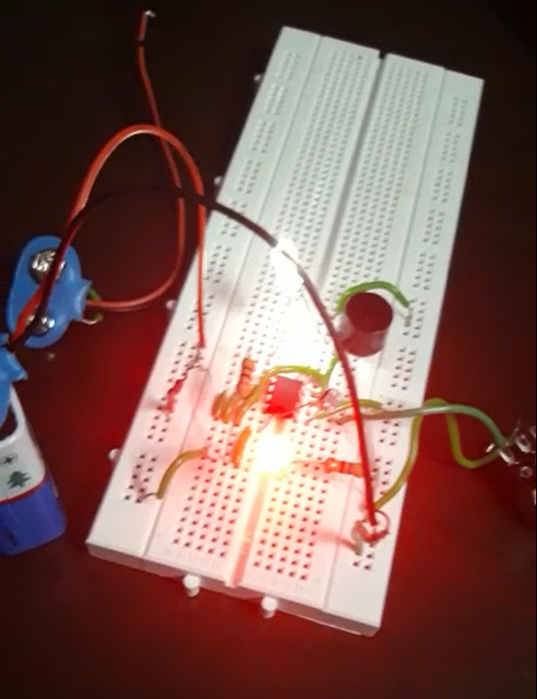

# Super-Sensitive-Intruder-Alarm
This project is used to detect moving objects that help in identifying intruders. Employed LDR to detect changes in light intensity, signaling the 555-timer, working as a comparator, which creates an alarm indicating movement.

